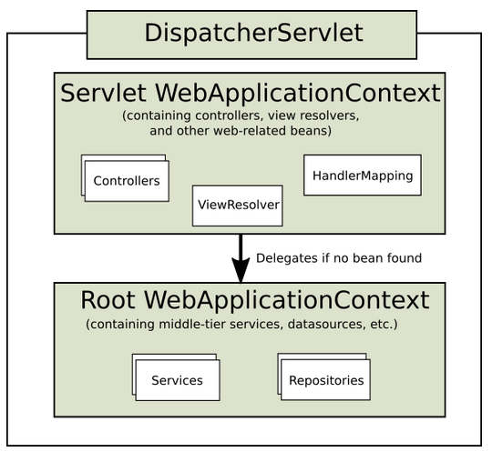

### notebook for spring-mvc

#### 1. 上下文的初始化

   spring mvc存在两个上下文, 一个是root 上下文, 另一个是servlet上下文, servlet上下文的父上下文是root上下文.
   servlet上下文包含了controllers, view resolvers等mvc中需要的组件, root上下文则包含了
   services, repositories 
   
   
   
   ```
    <!--配置springmvc DispatcherServlet-->
    <servlet>
        <servlet-name>springMVC</servlet-name>
        <servlet-class>org.springframework.web.servlet.DispatcherServlet</servlet-class>
        <init-param>
            <!--配置dispatcher.xml作为mvc的配置文件-->
            <param-name>contextConfigLocation</param-name>
            <param-value>/WEB-INF/dispatcher-servlet.xml</param-value>
        </init-param>
        <load-on-startup>1</load-on-startup>
        <async-supported>true</async-supported>
    </servlet>
    <servlet-mapping>
        <servlet-name>springMVC</servlet-name>
        <url-pattern>/</url-pattern>
    </servlet-mapping>
    <!--把applicationContext.xml加入到配置文件中-->
    <context-param>
        <param-name>contextConfigLocation</param-name>
        <param-value>/WEB-INF/applicationContext.xml</param-value>
    </context-param>
    <listener>
        <listener-class>org.springframework.web.context.ContextLoaderListener</listener-class>
    </listener>
 ```

   上面的配置是web.xml中的配置, root上下文由 org.springframework.web.context.ContextLoaderListener 
   监听器进行加载初始化, <listener/>符合servlet规范, 该监听器会随着web容器启动web应用而调用. 
   
   Servlet上下文 由  org.springframework.web.servlet.DispatcherServlet 自身进行初始化, 
   dispatcherServlet和其他mvc框架一样, 也是基于前端控制器模式(the front controller pattern), 
   将dispatcherServlet当做中心servlet, 它将会监听所有请求, 并分发请求到对应的controller处理
   
   
   
#### 2. root 上下文的初始化
   
   // ===========================  
   // 初始化上下文 
   ##### 2.1) 初始化上下文的步骤
    
   ```
    public WebApplicationContext initWebApplicationContext(ServletContext servletContext) {
        1. 在servletContext属性中检测是否已经存在 rootWebApplicationContext, 
        2. 创建web application context 到 本地变量
           // Store context in local instance variable, to guarantee that
            // it is available on ServletContext shutdown.
            if (this.context == null) {
                this.context = createWebApplicationContext(servletContext);  // 仅仅是通过反射创建实例 
            }
            
        3.  如果是 ConfigurableWebApplicationContext 的实例, 
            则加载父类上下文 (loadParentContext(ServletContext servletContext) )
            然后配置刷新上下文. (configureAndRefreshWebApplicationContext(cwac, servletContext);)
            
        4.  设置实例化的上下文到 servletContext
        
        5.  返回上下文          
   
    }
   ```
   
   
   ###### 对于可配置的上下文, 尝试加载父上下文
   
   ```
   protected ApplicationContext loadParentContext(ServletContext servletContext) {
   		ApplicationContext parentContext = null;
   		String locatorFactorySelector = servletContext.getInitParameter(LOCATOR_FACTORY_SELECTOR_PARAM);
   		String parentContextKey = servletContext.getInitParameter(LOCATOR_FACTORY_KEY_PARAM);
   
   		if (parentContextKey != null) {
   		    // 单例bean工厂定位符 
   			// locatorFactorySelector may be null, indicating the default "classpath*:beanRefContext.xml"
   			BeanFactoryLocator locator = ContextSingletonBeanFactoryLocator.getInstance(locatorFactorySelector);
   			Log logger = LogFactory.getLog(ContextLoader.class);
   			if (logger.isDebugEnabled()) {
   				logger.debug("Getting parent context definition: using parent context key of '" +
   						parentContextKey + "' with BeanFactoryLocator");
   			}
   			// 使用单例的BeanFactory, context实现了BeanFactory接口.
   			this.parentContextRef = locator.useBeanFactory(parentContextKey);
   			parentContext = (ApplicationContext) this.parentContextRef.getFactory();
   		}
   
   		return parentContext;
   	}
   ```
    
   ###### 配置和刷新应用上下文 
   ```
   protected void configureAndRefreshWebApplicationContext(ConfigurableWebApplicationContext wac, ServletContext sc) {
        //1. 上下文id
   		if (ObjectUtils.identityToString(wac).equals(wac.getId())) {
   			// The application context id is still set to its original default value
   			// -> assign a more useful id based on available information
   			String idParam = sc.getInitParameter(CONTEXT_ID_PARAM);
   			if (idParam != null) {
   				wac.setId(idParam);
   			}
   			else {
   				// Generate default id...
   				wac.setId(ConfigurableWebApplicationContext.APPLICATION_CONTEXT_ID_PREFIX +
   						ObjectUtils.getDisplayString(sc.getContextPath()));
   			}
   		}
   
        //2. 设置servletContext到可配置上下文中
   		wac.setServletContext(sc);
   		String configLocationParam = sc.getInitParameter(CONFIG_LOCATION_PARAM);  // 从上下文中获取配置参数, 并设置到可配置上下文中 
   		if (configLocationParam != null) {
   			wac.setConfigLocation(configLocationParam);
   		}
   
   		// The wac environment's #initPropertySources will be called in any case when the context
   		// is refreshed; do it eagerly here to ensure servlet property sources are in place for
   		// use in any post-processing or initialization that occurs below prior to #refresh
   		ConfigurableEnvironment env = wac.getEnvironment();
   		if (env instanceof ConfigurableWebEnvironment) {
   			((ConfigurableWebEnvironment) env).initPropertySources(sc, null);   // 初始化属性  (environment) 
   		}
   
   		customizeContext(sc, wac);   // 自定义上下文 
   		wac.refresh();  // 刷新, 原来是启动web应用之后, 初始上下文,  然后调用这个刷新  (可配置上下文才可以刷新)  
   	}
   ``` 
   
   
   // ========================================  
   // 关闭web应用上下文  
   ##### 2.2) 关闭上下文的步骤
   ```
   public void closeWebApplicationContext(ServletContext servletContext) {
   		servletContext.log("Closing Spring root WebApplicationContext");
   		try {
   			if (this.context instanceof ConfigurableWebApplicationContext) {
   				((ConfigurableWebApplicationContext) this.context).close();
   			}
   		}
   		finally {
   			ClassLoader ccl = Thread.currentThread().getContextClassLoader();
   			if (ccl == ContextLoader.class.getClassLoader()) {
   				currentContext = null;
   			}
   			else if (ccl != null) {
   				currentContextPerThread.remove(ccl);
   			}
   			servletContext.removeAttribute(WebApplicationContext.ROOT_WEB_APPLICATION_CONTEXT_ATTRIBUTE);
   			if (this.parentContextRef != null) {
   				this.parentContextRef.release();
   			}
   		}
   	}
   ```
   
   // ========================= 
   // protected Class<?> determineContextClass(ServletContext servletContext) {
   // String contextClassName = servletContext.getInitParameter(CONTEXT_CLASS_PARAM);
   // 默认加载的上下文类  ContextLoader.properties
   ```
   org.springframework.web.context.WebApplicationContext=org.springframework.web.context.support.XmlWebApplicationContext
   ```
   
   
   
   
   
   
   
   
   
   
   
   
   
   
   
    
    


