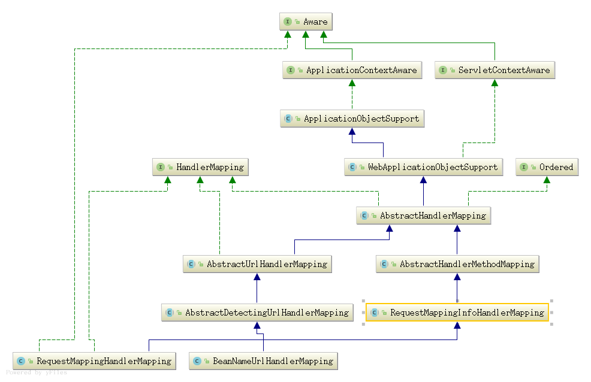

#### HandlerMapping组件

##### 1. HandlerMapping类继承
   
   ApplicationObjectSupport  implements ApplicationContextAware      
             ^   
            | |   
            | |  拥有applicationContext   
            | |   
   WebApplicationObjectSupport implements ServletContextAware 
             ^        
            | |  拥有servletContext属性,方便访问servletContext      
            | |         
   AbstractHandlerMapping implements HandlerMapping, Ordered     
             ^        
            | | 属性, List<Object> interceptors, List<HandlerInterceptor> adaptedInterceptors       
            | | 实现getHandler(HttpServletRequest)方法, 留有空方法getHandlerInternal(request)供子类实现
            | | 主要作用是将request和handler映射起来, 二是将拦截器,处理器包装成处理器执行链返回   
            | | =============================================================================================| |          
            | |                                                                                              | |                
   AbstractHandlerMethodMapping<T>  implements InitializingBean                                       AbstractUrlHandlerMapping           
             ^         
            | |  <T> 该泛型, 包含了request和handlerMethod匹配的条件              
            | |  属性, MappingRegistry mappingRegistry,  HandlerMethodMappingNamingStrategy<T> namingStrategy; 
            | |  实现handlerMethod=getHandlerInternal(request)                      
            | |  主要作用是将request和HandlerMethod映射起来, 映射关系存放于handlerMapping中             
            | |  实现afterPropertiesSet()方法,初始化对应的handlerMethod        
   RequestMappingInfoHandlerMapping            
             ^ 
            | |  抽象类, 实现了匹配条件为RequestMappingInfo的大部分方法
            | |  实现了getMappingPathPatterns(RequestMappingInfo info),           
            | |  getMatchingMapping(RequestMappingInfo info, HttpServletRequest request),             
            | |  getMappingComparator(final HttpServletRequest request)                                     
            | |                 
   RequestMappingHandlerMapping       
             ^       
            | |   实例用于@RequestMapping和@Controller             
            | |       
            | |           
   
   
   
   
                          
                   
            
                    
   
   

