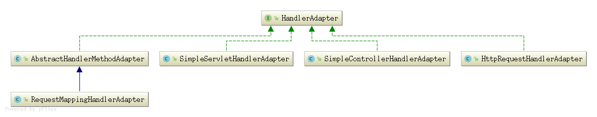

#### HandlerAdapter组件

   

##### 1. HandlerAdapter类图  

   HandlerAdapter 
            ^     
            |   boolean supports(Object handler);  // 一般使用instanceof 判断是否是某个类型的处理器  
            |   // 转换成Object类型的handler为对应实际类型, 调用对应方法处理, 返回modelAndView               
            |   ModelAndView handle(HttpServletRequest request, HttpServletResponse response, Object handler) throws Exception;       
            |   long getLastModified(HttpServletRequest request, Object handler);  // 返回最后修改的时间     
            |  ---------------------------------------------------------------------- |          
            |                                                                         |                                    
   AbstractHandlerMethodAdapter                                      SimpleServletHandlerAdapter,                                                     
             ^     
            | |           
            | |           
            | |           
   RequestMappingHandlerAdapter     
             ^                     
            | |   implements BeanFactoryAware, InitializingBean 
            | |  afterPropertiesSet(), supportsInternal()  ,  handleInternal(),  getLastModifiedInternal()      
            | |       
   

##### 2. AbstractHandlerMethodAdapter   extends WebContentGenerator implements HandlerAdapter, Ordered                 

  ######   2.1)  实现接口方法
  
  AbstractHandlerMethodAdapter#supports()     
  ```
  /**
  	 * This implementation expects the handler to be an {@link HandlerMethod}.
  	 * @param handler the handler instance to check
  	 * @return whether or not this adapter can adapt the given handler
  	 */
  	@Override
  	public final boolean supports(Object handler) {
  		return (handler instanceof HandlerMethod && supportsInternal((HandlerMethod) handler));
  	}
  ```   
  
  AbstractHandlerMethodAdapter#handle()
  ```
  /**
     * Given a handler method, return whether or not this adapter can support it.
     * @param handlerMethod the handler method to check
     * @return whether or not this adapter can adapt the given method
     */
    protected abstract boolean supportsInternal(HandlerMethod handlerMethod);  // 用于判断是否支持
    
  ```
  
  
  ```
  	/**
  	 * This implementation expects the handler to be an {@link HandlerMethod}.
  	 */
  	@Override
  	public final ModelAndView handle(HttpServletRequest request, HttpServletResponse response, Object handler)
  			throws Exception {
  
  		return handleInternal(request, response, (HandlerMethod) handler);
  	}
  	
  	/**
    	 * Use the given handler method to handle the request.
    	 * @param request current HTTP request
    	 * @param response current HTTP response
    	 * @param handlerMethod handler method to use. This object must have previously been passed to the
    	 * {@link #supportsInternal(HandlerMethod)} this interface, which must have returned {@code true}.
    	 * @return ModelAndView object with the name of the view and the required model data,
    	 * or {@code null} if the request has been handled directly
    	 * @throws Exception in case of errors
    	 */
    	protected abstract ModelAndView handleInternal(HttpServletRequest request,
    			HttpServletResponse response, HandlerMethod handlerMethod) throws Exception;
  ``` 


  AbstractHandlerMethodAdapter#getLastModified()      
  ```
  /**
  	 * This implementation expects the handler to be an {@link HandlerMethod}.
  	 */
  	@Override
  	public final long getLastModified(HttpServletRequest request, Object handler) {
  		return getLastModifiedInternal(request, (HandlerMethod) handler);
  	}
  
  	/**
  	 * Same contract as for {@link javax.servlet.http.HttpServlet#getLastModified(HttpServletRequest)}.
  	 * @param request current HTTP request
  	 * @param handlerMethod handler method to use
  	 * @return the lastModified value for the given handler
  	 */
  	protected abstract long getLastModifiedInternal(HttpServletRequest request, HandlerMethod handlerMethod);

  ```


##### 3. RequestMappingHandlerAdapter extends AbstractHandlerMethodAdapter implements BeanFactoryAware, InitializingBean 

   ###### 3.1) 属性      

   ```
   	private List<HandlerMethodArgumentResolver> customArgumentResolvers;
   
   	private HandlerMethodArgumentResolverComposite argumentResolvers;  // 解析方法参数的组件 
   
   	private HandlerMethodArgumentResolverComposite initBinderArgumentResolvers;  // 初始化数据的组件
   
   	private List<HandlerMethodReturnValueHandler> customReturnValueHandlers;
   
   	private HandlerMethodReturnValueHandlerComposite returnValueHandlers;  // 解析返回值的组件      
   
   	private List<ModelAndViewResolver> modelAndViewResolvers;  // 解析modelAndView的组件         
   
   	private ContentNegotiationManager contentNegotiationManager = new ContentNegotiationManager();
   
   	private List<HttpMessageConverter<?>> messageConverters; // 消息转换器      
   
   	private List<Object> requestResponseBodyAdvice = new ArrayList<Object>();
   
   	private WebBindingInitializer webBindingInitializer;  // web绑定初始器   
   ```


   ###### 3.2)  初始化      
   ```
   @Override
   	public void afterPropertiesSet() {
   		// Do this first, it may add ResponseBody advice beans
   		initControllerAdviceCache();
   
        // 初始化方法参数解析器   
   		if (this.argumentResolvers == null) {
   		   // 获取默认的参数解析器 
   			List<HandlerMethodArgumentResolver> resolvers = getDefaultArgumentResolvers(); 
   			this.argumentResolvers = new HandlerMethodArgumentResolverComposite().addResolvers(resolvers);
   		}
   		
   		if (this.initBinderArgumentResolvers == null) {
   			List<HandlerMethodArgumentResolver> resolvers = getDefaultInitBinderArgumentResolvers();
   			this.initBinderArgumentResolvers = new HandlerMethodArgumentResolverComposite().addResolvers(resolvers);
   		}
   		
   		// 初始化处理器方法返回值解析器  
   		if (this.returnValueHandlers == null) {
   		    // 获取默认的返回值解析器   
   			List<HandlerMethodReturnValueHandler> handlers = getDefaultReturnValueHandlers();
   			this.returnValueHandlers = new HandlerMethodReturnValueHandlerComposite().addHandlers(handlers);
   		}
   	}
   ```
   
   
   ```
   /**
   	 * Return the list of argument resolvers to use including built-in resolvers
   	 * and custom resolvers provided via {@link #setCustomArgumentResolvers}.
   	 */
   	private List<HandlerMethodArgumentResolver> getDefaultArgumentResolvers() {
   		List<HandlerMethodArgumentResolver> resolvers = new ArrayList<HandlerMethodArgumentResolver>();
   
   		// Annotation-based argument resolution
   		resolvers.add(new RequestParamMethodArgumentResolver(getBeanFactory(), false));
   		resolvers.add(new RequestParamMapMethodArgumentResolver());
   		resolvers.add(new PathVariableMethodArgumentResolver());
   		resolvers.add(new PathVariableMapMethodArgumentResolver());
   		resolvers.add(new MatrixVariableMethodArgumentResolver());
   		resolvers.add(new MatrixVariableMapMethodArgumentResolver());
   		resolvers.add(new ServletModelAttributeMethodProcessor(false));
   		resolvers.add(new RequestResponseBodyMethodProcessor(getMessageConverters(), this.requestResponseBodyAdvice));
   		resolvers.add(new RequestPartMethodArgumentResolver(getMessageConverters(), this.requestResponseBodyAdvice));
   		resolvers.add(new RequestHeaderMethodArgumentResolver(getBeanFactory()));
   		resolvers.add(new RequestHeaderMapMethodArgumentResolver());
   		resolvers.add(new ServletCookieValueMethodArgumentResolver(getBeanFactory()));
   		resolvers.add(new ExpressionValueMethodArgumentResolver(getBeanFactory()));
   		resolvers.add(new SessionAttributeMethodArgumentResolver());
   		resolvers.add(new RequestAttributeMethodArgumentResolver());
   
   		// Type-based argument resolution
   		resolvers.add(new ServletRequestMethodArgumentResolver());
   		resolvers.add(new ServletResponseMethodArgumentResolver());
   		resolvers.add(new HttpEntityMethodProcessor(getMessageConverters(), this.requestResponseBodyAdvice));
   		resolvers.add(new RedirectAttributesMethodArgumentResolver());
   		resolvers.add(new ModelMethodProcessor());
   		resolvers.add(new MapMethodProcessor());
   		resolvers.add(new ErrorsMethodArgumentResolver());
   		resolvers.add(new SessionStatusMethodArgumentResolver());
   		resolvers.add(new UriComponentsBuilderMethodArgumentResolver());
   
   		// Custom arguments
   		if (getCustomArgumentResolvers() != null) {
   			resolvers.addAll(getCustomArgumentResolvers());
   		}
   
   		// Catch-all
   		resolvers.add(new RequestParamMethodArgumentResolver(getBeanFactory(), true));
   		resolvers.add(new ServletModelAttributeMethodProcessor(true));
   
   		return resolvers;
   	}
   ```
   
   ```
   /**
   	 * Return the list of return value handlers to use including built-in and
   	 * custom handlers provided via {@link #setReturnValueHandlers}.
   	 */
   	private List<HandlerMethodReturnValueHandler> getDefaultReturnValueHandlers() {
   		List<HandlerMethodReturnValueHandler> handlers = new ArrayList<HandlerMethodReturnValueHandler>();
   
   		// Single-purpose return value types
   		handlers.add(new ModelAndViewMethodReturnValueHandler());
   		handlers.add(new ModelMethodProcessor());
   		handlers.add(new ViewMethodReturnValueHandler());
   		
   		// 可以通过setMessageConverters()来设置, 一般用来配置json     
   		handlers.add(new ResponseBodyEmitterReturnValueHandler(getMessageConverters()));   
   		handlers.add(new StreamingResponseBodyReturnValueHandler());
   		handlers.add(new HttpEntityMethodProcessor(getMessageConverters(),
   				this.contentNegotiationManager, this.requestResponseBodyAdvice));
   		handlers.add(new HttpHeadersReturnValueHandler());
   		handlers.add(new CallableMethodReturnValueHandler());
   		handlers.add(new DeferredResultMethodReturnValueHandler());
   		handlers.add(new AsyncTaskMethodReturnValueHandler(this.beanFactory));
   
   		// Annotation-based return value types
   		handlers.add(new ModelAttributeMethodProcessor(false));
   		handlers.add(new RequestResponseBodyMethodProcessor(getMessageConverters(),
   				this.contentNegotiationManager, this.requestResponseBodyAdvice));
   
   		// Multi-purpose return value types
   		handlers.add(new ViewNameMethodReturnValueHandler());
   		handlers.add(new MapMethodProcessor());
   
   		// Custom return value types
   		if (getCustomReturnValueHandlers() != null) {
   			handlers.addAll(getCustomReturnValueHandlers());
   		}
   
   		// Catch-all
   		if (!CollectionUtils.isEmpty(getModelAndViewResolvers())) {
   			handlers.add(new ModelAndViewResolverMethodReturnValueHandler(getModelAndViewResolvers()));
   		}
   		else {
   			handlers.add(new ModelAttributeMethodProcessor(true));
   		}
   
   		return handlers;
   	}
   ```
   
   
   


