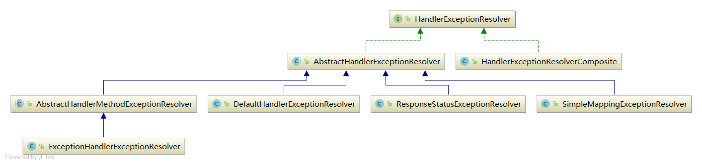

#### HandlerExceptionResolver组件  

   

##### 1. HandlerExceptionResolver类图     
   
   HandlerExceptionResolver
             ^       
             |    // 将异常转换成一个精确的错误页                
             |    ModelAndView resolveException(HttpServletRequest request, HttpServletResponse response, Object handler, Exception ex);      
             |
             | -------------------------------------------------------------------------------------------------|
             |                                                                                                  |           
   AbstractHandlerMethodExceptionResolver                                                             DefaultHandlerExceptionResolver                                           
             ^         
            | |             
            | |           
            | |         
   ExceptionHandlerExceptionResolver        
            | |                                                      
            | |            
            | |           

