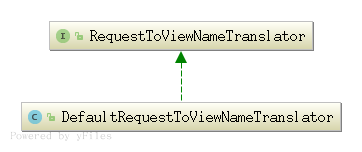

#### RequestToViewNameTranslator组件

         
   
   
##### 1. RequestToViewNameTranslator组件类图   

   
   RequestToViewNameTranslator
             ^            
             |       
             |     String getViewName(HttpServletRequest request) throws Exception;          
             |     //从request提供的servlet上下文中, 将request转换对应的视图名字    
             |                     
   DefaultRequestToViewNameTranslator       
            | |      
            | |    
            | |    实现getViewName()方法    
            | |                
   
   
##### 2. DefaultRequestToViewNameTranslator       
   
   ###### 2.1) 属性  
   ```
   private static final String SLASH = "/";
   
   	private String prefix = "";
   
   	private String suffix = "";
   
   	private String separator = SLASH;
   
   	private boolean stripLeadingSlash = true;
   
   	private boolean stripTrailingSlash = true;
   
   	private boolean stripExtension = true;
   
   	private UrlPathHelper urlPathHelper = new UrlPathHelper();
   ```
   
   ###### 2.2) 实现接口
   ```
   /**
   	 * Translates the request URI of the incoming {@link HttpServletRequest}
   	 * into the view name based on the configured parameters.
   	 * @see org.springframework.web.util.UrlPathHelper#getLookupPathForRequest
   	 * @see #transformPath
   	 */
   	@Override
   	public String getViewName(HttpServletRequest request) {
   		String lookupPath = this.urlPathHelper.getLookupPathForRequest(request);
   		
   		// 前缀 + "转换路径" + 后缀  
   		return (this.prefix + transformPath(lookupPath) + this.suffix);
   	}
   ```
   
   ```
   /**
   	 * Transform the request URI (in the context of the webapp) stripping
   	 * slashes and extensions, and replacing the separator as required.
   	 * @param lookupPath the lookup path for the current request,
   	 * as determined by the UrlPathHelper
   	 * @return the transformed path, with slashes and extensions stripped
   	 * if desired
   	 */
   	protected String transformPath(String lookupPath) {
   		String path = lookupPath;
   		if (this.stripLeadingSlash && path.startsWith(SLASH)) {
   			path = path.substring(1);
   		}
   		if (this.stripTrailingSlash && path.endsWith(SLASH)) {
   			path = path.substring(0, path.length() - 1);
   		}
   		if (this.stripExtension) {
   			path = StringUtils.stripFilenameExtension(path);
   		}
   		if (!SLASH.equals(this.separator)) {
   			path = StringUtils.replace(path, SLASH, this.separator);
   		}
   		return path;
   	}
   ```
  


