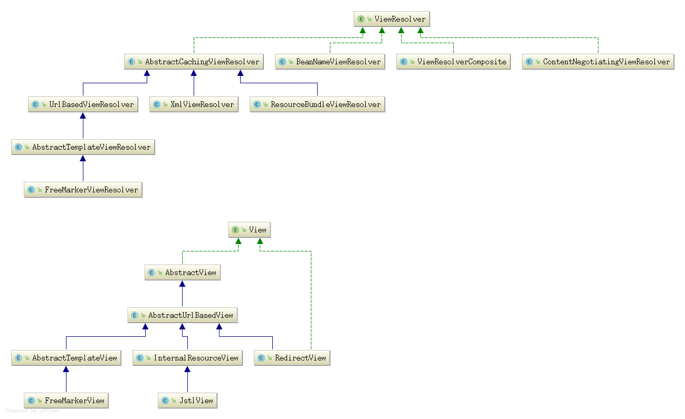

#### ViewResolver组件     

   

##### 1. ViewResolver组件类图   

   ViewResolver
          ^     
          |    
          | View resolveViewName(String viewName, Locale locale) throws Exception;
          |      
          | ----------------------------------------------------------------------------|       
          |                                                                             |        
   AbstractCachingViewResolver                                                     ResourceBundleViewResolver(解决多国语言)                
          ^     
         | |    
         | |  实现了缓存功能, 用于缓存模板, 子类实现loadView()用于建立一个View对象           
         | |    
   UrlBasedViewResolver       
          ^      
         | |    
         | |  viewName是url的解决方案, redirect:myAction, forward:myAction        
         | |    
   AbstractTemplateViewResolver    
          ^      
         | |    
         | |  模板视图的基类解析器, 一般用于freemarker, velocity                      
         | |    
   FreeMarkerViewResolver        


##### 2. AbstractCachingViewResolver extends WebApplicationObjectSupport implements ViewResolver      

   ###### 2.1) 属性   
   ```
   /** Default maximum number of entries for the view cache: 1024 */
   	public static final int DEFAULT_CACHE_LIMIT = 1024;
   
   	/** Dummy marker object for unresolved views in the cache Maps */
   	private static final View UNRESOLVED_VIEW = new View() {
   		@Override
   		public String getContentType() {
   			return null;
   		}
   		@Override
   		public void render(Map<String, ?> model, HttpServletRequest request, HttpServletResponse response) {
   		}
   	};
   
   
   	/** The maximum number of entries in the cache */
   	private volatile int cacheLimit = DEFAULT_CACHE_LIMIT;
   
   	/** Whether we should refrain from resolving views again if unresolved once */
   	private boolean cacheUnresolved = true;
   
   // 缓存view   
   	/** Fast access cache for Views, returning already cached instances without a global lock */
   	private final Map<Object, View> viewAccessCache = new ConcurrentHashMap<Object, View>(DEFAULT_CACHE_LIMIT);
   
   
   // 使用LRU缓存View实例 
   	/** Map from view key to View instance, synchronized for View creation */
   	@SuppressWarnings("serial")
   	private final Map<Object, View> viewCreationCache =
   			new LinkedHashMap<Object, View>(DEFAULT_CACHE_LIMIT, 0.75f, true) {
   				@Override
   				protected boolean removeEldestEntry(Map.Entry<Object, View> eldest) {
   					if (size() > getCacheLimit()) {
   						viewAccessCache.remove(eldest.getKey());
   						return true;
   					}
   					else {
   						return false;
   					}
   				}
   			};
   ```


   ###### 2.2) 实现接口  
   ```
   @Override
   	public View resolveViewName(String viewName, Locale locale) throws Exception {
   		if (!isCache()) {  // 判断缓存空间大小能否继续缓存   
   			return createView(viewName, locale); // 创建视图   
   		}
   		else {
   			Object cacheKey = getCacheKey(viewName, locale);     
   			View view = this.viewAccessCache.get(cacheKey);  // viewName + "_" + locale
   			if (view == null) {
   				synchronized (this.viewCreationCache) { //全局锁  
   					view = this.viewCreationCache.get(cacheKey);
   					if (view == null) {
   						// Ask the subclass to create the View object.
   						view = createView(viewName, locale);
   						if (view == null && this.cacheUnresolved) {
   							view = UNRESOLVED_VIEW;
   						}
   						if (view != null) {
   							this.viewAccessCache.put(cacheKey, view);  // 存放进去  
   							this.viewCreationCache.put(cacheKey, view);
   							if (logger.isTraceEnabled()) {
   								logger.trace("Cached view [" + cacheKey + "]");
   							}
   						}
   					}
   				}
   			}
   			return (view != UNRESOLVED_VIEW ? view : null);
   		}
   	}
   ```

   ```
   /**
   	 * Return the cache key for the given view name and the given locale.
   	 * <p>Default is a String consisting of view name and locale suffix.
   	 * Can be overridden in subclasses.
   	 * <p>Needs to respect the locale in general, as a different locale can
   	 * lead to a different view resource.
   	 */
   	protected Object getCacheKey(String viewName, Locale locale) {
   		return viewName + '_' + locale;
   	}
   ```  
   
   ```
   /**
   	 * Create the actual View object.
   	 * <p>The default implementation delegates to {@link #loadView}.
   	 * This can be overridden to resolve certain view names in a special fashion,
   	 * before delegating to the actual {@code loadView} implementation
   	 * provided by the subclass.
   	 * @param viewName the name of the view to retrieve
   	 * @param locale the Locale to retrieve the view for
   	 * @return the View instance, or {@code null} if not found
   	 * (optional, to allow for ViewResolver chaining)
   	 * @throws Exception if the view couldn't be resolved
   	 * @see #loadView
   	 */
   	protected View createView(String viewName, Locale locale) throws Exception {
   		return loadView(viewName, locale);
   	}
   
   	/**
   	 * Subclasses must implement this method, building a View object
   	 * for the specified view. The returned View objects will be
   	 * cached by this ViewResolver base class.
   	 * <p>Subclasses are not forced to support internationalization:
   	 * A subclass that does not may simply ignore the locale parameter.
   	 * @param viewName the name of the view to retrieve
   	 * @param locale the Locale to retrieve the view for
   	 * @return the View instance, or {@code null} if not found
   	 * (optional, to allow for ViewResolver chaining)
   	 * @throws Exception if the view couldn't be resolved
   	 * @see #resolveViewName
   	 */
   	protected abstract View loadView(String viewName, Locale locale) throws Exception;  // 留给子类继承  
   ```
   
   
##### 3. UrlBasedViewResolver extends AbstractCachingViewResolver implements Ordered   
   
   ###### 3.1) 属性  
   ```
   /**
   	 * Prefix for special view names that specify a redirect URL (usually
   	 * to a controller after a form has been submitted and processed).
   	 * Such view names will not be resolved in the configured default
   	 * way but rather be treated as special shortcut.
   	 */
   	public static final String REDIRECT_URL_PREFIX = "redirect:";
   
   	/**
   	 * Prefix for special view names that specify a forward URL (usually
   	 * to a controller after a form has been submitted and processed).
   	 * Such view names will not be resolved in the configured default
   	 * way but rather be treated as special shortcut.
   	 */
   	public static final String FORWARD_URL_PREFIX = "forward:";
   
   
   	private Class<?> viewClass;
   
   	private String prefix = "";
   
   	private String suffix = "";
   
   	private String contentType;
   
   	private boolean redirectContextRelative = true;
   
   	private boolean redirectHttp10Compatible = true;
   
   	private String[] redirectHosts;
   
   	private String requestContextAttribute;
   
   	/** Map of static attributes, keyed by attribute name (String) */
   	private final Map<String, Object> staticAttributes = new HashMap<String, Object>();
   
   	private Boolean exposePathVariables;
   
   	private Boolean exposeContextBeansAsAttributes;
   
   	private String[] exposedContextBeanNames;
   
   	private String[] viewNames;
   
   	private int order = Ordered.LOWEST_PRECEDENCE;
   ```


   ###### 3.2) 初始化    
   ```
   @Override
   	protected void initApplicationContext() {
   		super.initApplicationContext();
   		if (getViewClass() == null) {  // 仅仅判断需要设置ViewClass
   			throw new IllegalArgumentException("Property 'viewClass' is required");
   		}
   	}
   ```
   
   ###### 3.3) 重写AbstractCachingViewResolver方法      
   
   ```
   /**
   	 * This implementation returns just the view name,
   	 * as this ViewResolver doesn't support localized resolution.
   	 */
   	@Override
   	protected Object getCacheKey(String viewName, Locale locale) {
   		return viewName;
   	}
   
   	/**
   	 * Overridden to implement check for "redirect:" prefix.
   	 * <p>Not possible in {@code loadView}, since overridden
   	 * {@code loadView} versions in subclasses might rely on the
   	 * superclass always creating instances of the required view class.
   	 * @see #loadView
   	 * @see #requiredViewClass
   	 */
   	@Override
   	protected View createView(String viewName, Locale locale) throws Exception {
   		// If this resolver is not supposed to handle the given view,
   		// return null to pass on to the next resolver in the chain.
   		if (!canHandle(viewName, locale)) {
   			return null;
   		}
   
   		// Check for special "redirect:" prefix.
   		if (viewName.startsWith(REDIRECT_URL_PREFIX)) {  // 创建重定向View
   			String redirectUrl = viewName.substring(REDIRECT_URL_PREFIX.length());
   			RedirectView view = new RedirectView(redirectUrl,
   					isRedirectContextRelative(), isRedirectHttp10Compatible());
   			view.setHosts(getRedirectHosts());
   			return applyLifecycleMethods(REDIRECT_URL_PREFIX, view);
   		}
   
   		// Check for special "forward:" prefix.
   		if (viewName.startsWith(FORWARD_URL_PREFIX)) {
   			String forwardUrl = viewName.substring(FORWARD_URL_PREFIX.length());
   			return new InternalResourceView(forwardUrl);  // 转发内部资源, 可以共享request资源    
   		}
   
   		// Else fall back to superclass implementation: calling loadView.
   		return super.createView(viewName, locale);
   	}
   ```
   
   ###### 3.4) 实现AbstractCachingViewResolver方法
   ```
   /**
   	 * Delegates to {@code buildView} for creating a new instance of the
   	 * specified view class. Applies the following Spring lifecycle methods
   	 * (as supported by the generic Spring bean factory):
   	 * <ul>
   	 * <li>ApplicationContextAware's {@code setApplicationContext}
   	 * <li>InitializingBean's {@code afterPropertiesSet}
   	 * </ul>
   	 * @param viewName the name of the view to retrieve
   	 * @return the View instance
   	 * @throws Exception if the view couldn't be resolved
   	 * @see #buildView(String)
   	 * @see org.springframework.context.ApplicationContextAware#setApplicationContext
   	 * @see org.springframework.beans.factory.InitializingBean#afterPropertiesSet
   	 */
   	@Override
   	protected View loadView(String viewName, Locale locale) throws Exception {
   		AbstractUrlBasedView view = buildView(viewName);
   		View result = applyLifecycleMethods(viewName, view);
   		return (view.checkResource(locale) ? result : null);
   	}
   ```
   
   ```
   /**
   	 * Creates a new View instance of the specified view class and configures it.
   	 * Does <i>not</i> perform any lookup for pre-defined View instances.
   	 * <p>Spring lifecycle methods as defined by the bean container do not have to
   	 * be called here; those will be applied by the {@code loadView} method
   	 * after this method returns.
   	 * <p>Subclasses will typically call {@code super.buildView(viewName)}
   	 * first, before setting further properties themselves. {@code loadView}
   	 * will then apply Spring lifecycle methods at the end of this process.
   	 * @param viewName the name of the view to build
   	 * @return the View instance
   	 * @throws Exception if the view couldn't be resolved
   	 * @see #loadView(String, java.util.Locale)
   	 */
   	protected AbstractUrlBasedView buildView(String viewName) throws Exception {
   		AbstractUrlBasedView view = (AbstractUrlBasedView) BeanUtils.instantiateClass(getViewClass());
   		view.setUrl(getPrefix() + viewName + getSuffix());
   
   		String contentType = getContentType();
   		if (contentType != null) {
   			view.setContentType(contentType);
   		}
   
   		view.setRequestContextAttribute(getRequestContextAttribute());
   		view.setAttributesMap(getAttributesMap());
   
   		Boolean exposePathVariables = getExposePathVariables();
   		if (exposePathVariables != null) {
   			view.setExposePathVariables(exposePathVariables);
   		}
   		Boolean exposeContextBeansAsAttributes = getExposeContextBeansAsAttributes();
   		if (exposeContextBeansAsAttributes != null) {
   			view.setExposeContextBeansAsAttributes(exposeContextBeansAsAttributes);
   		}
   		String[] exposedContextBeanNames = getExposedContextBeanNames();
   		if (exposedContextBeanNames != null) {
   			view.setExposedContextBeanNames(exposedContextBeanNames);
   		}
   
   		return view;
   	}
   ```   
   
   ```
   private View applyLifecycleMethods(String viewName, AbstractView view) {
   		return (View) getApplicationContext().getAutowireCapableBeanFactory().initializeBean(view, viewName);
   	}
   ```

##### 4. FreeMarkerViewResolver extends AbstractTemplateViewResolver     
   ```
   /**
   	 * Sets the default {@link #setViewClass view class} to {@link #requiredViewClass}:
   	 * by default {@link FreeMarkerView}.
   	 */
   	public FreeMarkerViewResolver() {
   		setViewClass(requiredViewClass());
   	}
   
   	/**
   	 * A convenience constructor that allows for specifying {@link #setPrefix prefix}
   	 * and {@link #setSuffix suffix} as constructor arguments.
   	 * @param prefix the prefix that gets prepended to view names when building a URL
   	 * @param suffix the suffix that gets appended to view names when building a URL
   	 * @since 4.3
   	 */
   	public FreeMarkerViewResolver(String prefix, String suffix) {
   		this();
   		setPrefix(prefix);
   		setSuffix(suffix);
   	}
   
   
   // 主要是设置ViewClass
   	/**
   	 * Requires {@link FreeMarkerView}.
   	 */
   	@Override
   	protected Class<?> requiredViewClass() {
   		return FreeMarkerView.class;
   	}

   ```

   总结, ViewResolver主要是用于查找构建View对象实例, 附加额外的公共的操作,  如缓存, 基于url的查找视图, 
   对于视图的渲染操作, 则委托于View对象   


